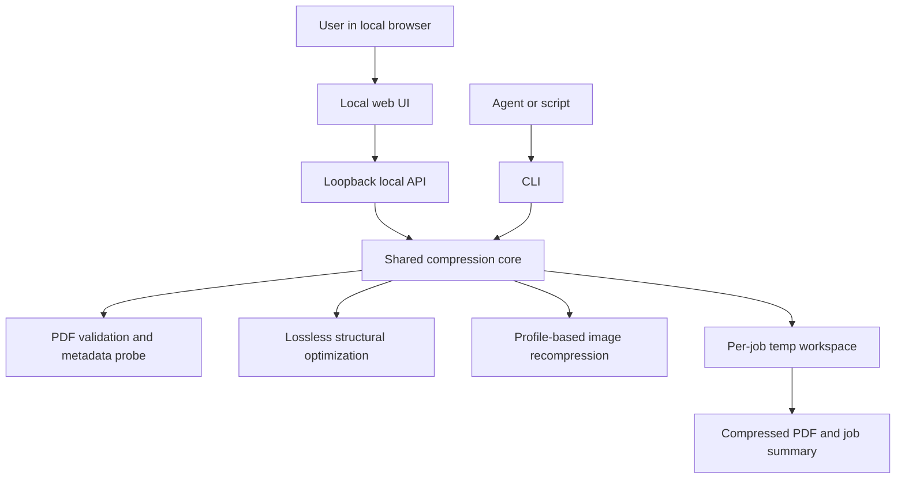
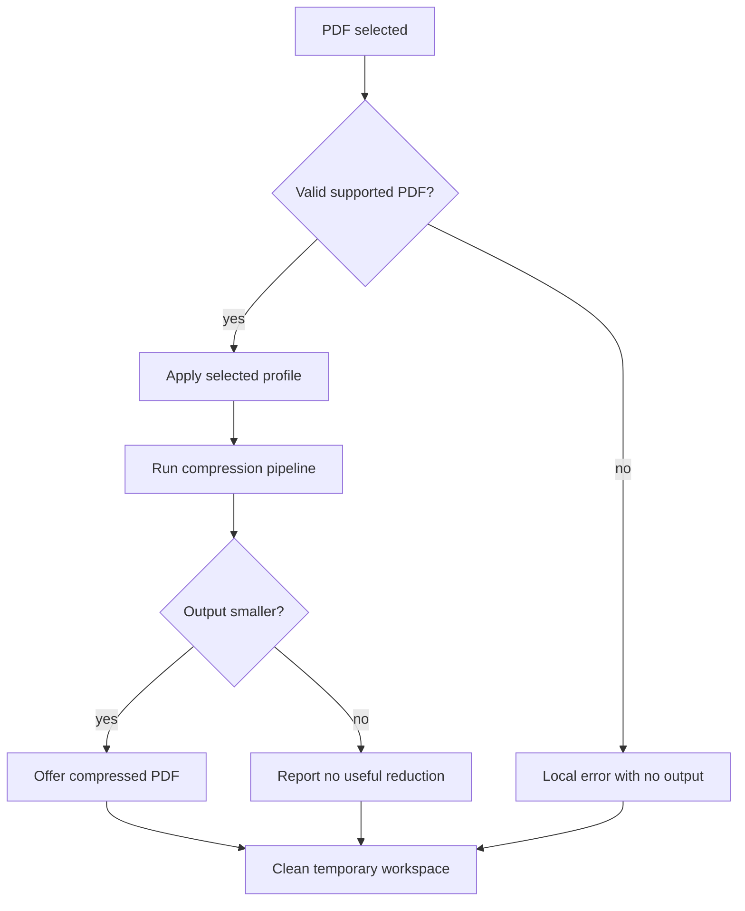

# Local PDF Compressor - Plan

## Goal Capsule

| Field | Value |
|---|---|
| Objective | Build an open-source, local-first PDF compressor with a Smallpdf-like web workflow and a shared CLI for agents and automation. |
| Authority | User request and this plan's Product Contract. |
| Execution profile | Greenfield repository; implement Web App first, shared compression engine second, CLI third. |
| Stop conditions | Stop before adding cloud upload, general PDF editing, OCR, signing, account features, or desktop packaging. |
| Tail ownership | Implementation should leave the repo ready for public GitHub development with docs, tests, and security posture visible. |

---

## Product Contract

### Summary

This plan targets a local PDF compression product: a browser-based app that runs on the user's machine, compresses PDFs without third-party upload, and exposes the same capability through a CLI for agents.
Desktop packaging is documented as a future path only.

### Problem Frame

People use tools like Smallpdf because the workflow is obvious: drop a PDF, pick compression, download a smaller file.
For sensitive documents, the upload model is the wrong privacy boundary.
The product must make local processing the core promise, not a hidden implementation detail.

### Requirements

**Local compression and privacy**

- R1. The app must compress PDF files locally without uploading document content to a third-party service.
- R2. The first user-facing surface must be a local web app with drag-and-drop input, compression controls, progress feedback, and downloadable output.
- R3. The product must show before/after file size, percentage reduction, and whether the output is smaller than the input.
- R4. Temporary working files must be isolated per job and cleaned after success, failure, or cancellation.
- R5. The app must avoid retaining source PDFs, compressed PDFs, or document metadata after a job unless the user explicitly saves the output.

**Compression behavior**

- R6. The compressor must support at least three profiles: conservative, balanced, and aggressive.
- R7. Conservative compression must prioritize document fidelity and lossless structural optimization.
- R8. Balanced and aggressive compression may downsample or recompress images, with the trade-off made visible before and after the job.
- R9. The compressor must reject unsupported, encrypted, or damaged PDFs with a clear local error instead of producing an unsafe or misleading output.
- R10. The app must never replace the original input file.

**CLI and agent availability**

- R11. The shared compression engine must be callable from a CLI with stable input, output, profile, and JSON-summary options.
- R12. The CLI must return machine-readable success, warning, and failure information suitable for agents and scripts.
- R13. The CLI and web app must use the same compression engine and profile definitions.

**Open-source project posture**

- R14. The repository must include contributor-facing documentation for setup, compression architecture, privacy guarantees, and security reporting.
- R15. Dependency and license choices must stay compatible with an auditable open-source release.
- R16. Desktop packaging must remain deferred until the local web app and CLI are usable.

### Acceptance Examples

- AE1. Given a valid image-heavy PDF, when the user chooses balanced compression in the local web app, then the app produces a downloadable PDF, shows original size, output size, and reduction percentage, and leaves no retained source file in app storage.
- AE2. Given a text-heavy PDF where compression cannot reduce size, when the user compresses it, then the app reports that the output is not smaller and offers the original-preserving result without overwriting the source.
- AE3. Given an encrypted PDF without a supplied password, when the user or CLI attempts compression, then the job fails locally with a clear unsupported/encrypted-file message.
- AE4. Given an agent calls the CLI with JSON output enabled, when compression succeeds, then stdout includes input path, output path, profile, original bytes, output bytes, reduction percent, warnings, and engine details.
- AE5. Given a compression job is cancelled from the web app, when cancellation completes, then partial outputs and temporary files for that job are removed.

### Scope Boundaries

In scope for the first implementation:

- Local web app for single-file PDF compression.
- Shared compression engine with profile-based behavior.
- CLI for single-file compression and machine-readable output.
- Security and privacy documentation.
- Public GitHub repository scaffolding.

#### Deferred to Follow-Up Work

- Batch compression.
- Desktop app packaging.
- Browser extension or share-sheet integration.
- Password entry and re-encryption flows.
- Cloud deployment, accounts, sync, storage, or team workspaces.
- OCR, PDF editing, page reordering, signing, conversion, watermarking, merging, and splitting.

---

## Planning Contract

### Key Technical Decisions

- KTD1. Use a local web app backed by a local runtime, not a hosted SaaS service.
  The browser gives the Smallpdf-like interaction model while the local runtime can safely call native PDF tools and enforce temporary-file cleanup.
- KTD2. Put compression logic in a shared core package consumed by both the web app and CLI.
  This prevents the agent-facing CLI from drifting away from the user-facing app.
- KTD3. Use a two-engine compression strategy: a lossless structural pass and an optional lossy image pass.
  qpdf is a strong fit for structural transformations and orphan-object cleanup, while Ghostscript-style pdfwrite controls cover downsampling and recompression profiles.
- KTD4. Treat aggressive compression as a profile with explicit fidelity risk, not a default.
  Local privacy should not come at the cost of surprising text loss, broken annotations, or unreadable scans.
- KTD5. Build the web app as a local-only service bound to loopback.
  This keeps browser ergonomics while avoiding a remote data boundary.
- KTD6. Keep desktop packaging outside the first release.
  The local web app plus CLI proves the product and engine before installer complexity enters the project.
- KTD7. Start with AGPL-3.0-or-later as the project license.
  This keeps the repository unambiguously open-source and compatible with AGPL-licensed PDF engine options if they are bundled or tightly distributed later.

### High-Level Technical Design





### Output Structure

```text
.
├── apps/
│   ├── web/
│   └── local-server/
├── packages/
│   ├── core/
│   └── cli/
├── docs/
│   ├── architecture/
│   ├── privacy.md
│   ├── security.md
│   └── plans/
├── tests/
│   └── fixtures/
└── README.md
```

### Sources & Research

- Ghostscript `pdfwrite` exposes compression controls for fonts, streams, image resolution, downsampling, and profile-like distiller parameters; it can reduce size but rewrites PDF internals, so fidelity checks matter. Source: https://ghostscript.readthedocs.io/en/latest/VectorDevices.html
- qpdf's command-line model reads a seekable input PDF, applies transformations in memory, removes orphaned objects in default rewrites, and writes an output file; this supports a conservative structural optimization pass. Source: https://qpdf.readthedocs.io/en/stable/cli.html
- PDF.js is a web standards-based PDF parsing and rendering platform and is suitable for local preview/inspection in the web app. Source: https://mozilla.github.io/pdf.js/

### Risks & Dependencies

| Risk | Mitigation |
|---|---|
| Compression may increase file size for already optimized PDFs. | Compare output size to input size and report no useful reduction instead of pretending success. |
| Lossy profiles can damage visual fidelity. | Default to conservative or balanced, label aggressive trade-offs, and add fixture-based visual/smoke checks. |
| Native PDF tools can have license constraints. | Decide license and bundling strategy before distributing binaries. |
| Malformed PDFs can trigger parser failures. | Run validation before compression, isolate temp workspaces, and surface local errors. |
| Local web service could accidentally expose files on the network. | Bind to loopback, avoid remote origins, and test host binding behavior. |

---

## Implementation Units

### U1. Repository and Project Scaffolding

- **Goal:** Establish the public project structure, package manager, TypeScript workspace, documentation skeleton, and basic quality gates.
- **Requirements:** R14, R15.
- **Dependencies:** None.
- **Files:** `README.md`, `.gitignore`, `package.json`, `pnpm-workspace.yaml`, `tsconfig.base.json`, `docs/privacy.md`, `docs/security.md`, `docs/architecture/compression-engine.md`, `tests/fixtures/README.md`.
- **Approach:** Create a monorepo with `apps/` for product surfaces and `packages/` for reusable engine and CLI code.
  Keep the first docs honest: local-only promise, current non-implementation state, dependency license notes, and security reporting path.
- **Execution note:** This is mostly packaging and documentation; prefer install/runtime smoke verification over unit coverage.
- **Patterns to follow:** Use plain npm scripts with predictable names for test, lint, typecheck, and dev entry points.
- **Test scenarios:** Test expectation: none -- scaffolding only; verification is package installation and script discovery.
- **Verification:** A contributor can install dependencies, list workspace packages, and find privacy/security documentation from the README.

### U2. Shared Compression Core

- **Goal:** Implement the engine contract that validates PDFs, runs compression profiles, compares file sizes, and returns a structured job summary.
- **Requirements:** R1, R3, R4, R5, R6, R7, R8, R9, R10, R13; covers AE1, AE2, AE3, AE5.
- **Dependencies:** U1.
- **Files:** `packages/core/src/index.ts`, `packages/core/src/compress.ts`, `packages/core/src/profiles.ts`, `packages/core/src/validation.ts`, `packages/core/src/temp-workspace.ts`, `packages/core/src/engines/qpdf.ts`, `packages/core/src/engines/ghostscript.ts`, `packages/core/test/compress.test.ts`, `packages/core/test/temp-workspace.test.ts`, `tests/fixtures/README.md`.
- **Approach:** Define one compression API that accepts an input path, output path, profile, cancellation signal, and reporting callback.
  Run validation before compression, create a per-job temp workspace, attempt the selected profile, compare byte sizes, and return warnings when the output is not smaller.
  Keep engine adapters behind interfaces so qpdf, Ghostscript, and future engines do not leak into UI or CLI contracts.
- **Execution note:** Implement profile and temp-workspace behavior test-first because it carries the privacy promise.
- **Patterns to follow:** Use adapter boundaries for external binaries and keep process execution wrapped in one module so timeouts, stderr capture, and error mapping stay consistent.
- **Test scenarios:**
  - Compress a valid fixture with a mocked lossless adapter and assert the summary includes original bytes, output bytes, reduction percent, profile, and engine details.
  - Compress a fixture where the mocked output is larger and assert the summary reports no useful reduction without replacing the input file.
  - Attempt an encrypted or unsupported fixture and assert the result is a local validation failure with no output.
  - Cancel a job after temp workspace creation and assert partial files are removed.
  - Simulate adapter failure and assert stderr is captured into a safe diagnostic without leaking full document content.
- **Verification:** The core can run through success, no-gain, validation-failure, adapter-failure, and cancellation paths with deterministic fixture tests.

### U3. Local Web App and Loopback API

- **Goal:** Build the Smallpdf-like local browser workflow that lets a user choose a PDF, pick a profile, watch progress, and download the compressed result.
- **Requirements:** R1, R2, R3, R4, R5, R6, R8, R9, R10, R13; covers AE1, AE2, AE3, AE5.
- **Dependencies:** U2.
- **Files:** `apps/web/src/App.tsx`, `apps/web/src/components/FileDropzone.tsx`, `apps/web/src/components/ProfileSelector.tsx`, `apps/web/src/components/JobProgress.tsx`, `apps/web/src/components/ResultSummary.tsx`, `apps/web/src/api/client.ts`, `apps/local-server/src/server.ts`, `apps/local-server/src/routes/compress.ts`, `apps/local-server/test/compress-route.test.ts`, `apps/web/test/compression-flow.test.tsx`.
- **Approach:** Serve the web app from a local server bound to loopback and expose a small compression API that streams progress and returns a downloadable local result token.
  The UI must keep the compression task central: file drop, profile choice, progress, result comparison, and download.
  Do not add account, cloud, or editing affordances.
- **Execution note:** Start with a failing route-level test for the upload-to-local-job contract before building UI polish.
- **Patterns to follow:** Keep server-side file handling inside the local server and keep browser state limited to job IDs, progress, and display metadata.
- **Test scenarios:**
  - Select a valid PDF, choose balanced profile, submit, and assert the UI shows progress and a successful reduction summary.
  - Select an encrypted PDF and assert the UI shows an unsupported/encrypted error with no download button.
  - Submit a PDF whose compressed output is larger and assert the UI labels the result as no useful reduction.
  - Cancel an in-flight job and assert the UI returns to a safe state and the server removes the temp workspace.
  - Verify the local server binds to loopback and does not accept non-local host bindings by default.
- **Verification:** A user can complete AE1 from the browser on a local machine, and route tests prove no remote upload boundary is introduced.

### U4. CLI for Agents and Automation

- **Goal:** Add a stable command-line interface that calls the shared core and emits machine-readable summaries.
- **Requirements:** R6, R9, R10, R11, R12, R13; covers AE3 and AE4.
- **Dependencies:** U2.
- **Files:** `packages/cli/src/index.ts`, `packages/cli/src/commands/compress.ts`, `packages/cli/src/output.ts`, `packages/cli/test/compress-command.test.ts`, `packages/cli/test/json-output.test.ts`, `docs/architecture/cli-contract.md`.
- **Approach:** Provide a `compress` command with input, output, profile, overwrite policy, and JSON summary options.
  Reuse the core directly rather than calling the local web API.
  Exit codes should distinguish success, validation failure, compression failure, and user cancellation.
- **Execution note:** Treat the JSON output as a public contract and cover it before broadening options.
- **Patterns to follow:** Keep human-readable progress on stderr when JSON output is enabled so agents can parse stdout safely.
- **Test scenarios:**
  - Run CLI compression against a valid fixture and assert output PDF creation plus a success exit code.
  - Run with JSON summary and assert stdout contains stable fields for paths, profile, byte counts, reduction percent, warnings, and engine details.
  - Run against an encrypted fixture and assert a validation-failure exit code with no output file.
  - Run with an existing output path and no overwrite flag and assert the input and existing output are preserved.
  - Simulate core cancellation and assert the CLI exits with the cancellation code and cleans partial output.
- **Verification:** Agents can invoke the CLI in JSON mode and make decisions from stdout without scraping UI text.

### U5. Privacy, Security, and License Hardening

- **Goal:** Make the local-first privacy promise auditable and prepare the repository for public AGPL-licensed open-source use.
- **Requirements:** R1, R4, R5, R14, R15.
- **Dependencies:** U1, U2, U3, U4.
- **Files:** `docs/privacy.md`, `docs/security.md`, `docs/architecture/compression-engine.md`, `docs/architecture/dependency-licenses.md`, `SECURITY.md`, `LICENSE`, `package.json`.
- **Approach:** Document what data is processed, where temp files live, how cleanup works, what telemetry is absent, and which dependencies or external binaries are required.
  Document why AGPL-3.0-or-later is the starting license and call out any extra obligations introduced by bundled PDF engine binaries.
- **Patterns to follow:** Keep privacy claims testable and tied to actual storage, network, and temp-file behavior.
- **Test scenarios:**
  - Verify no runtime telemetry endpoint or external upload configuration exists in default settings.
  - Verify temp cleanup tests from U2 and U3 are referenced from privacy documentation.
  - Verify dependency-license documentation names each PDF engine and distribution implication.
  - Verify repository metadata, README, and `LICENSE` agree on AGPL-3.0-or-later.
  - Verify security reporting instructions are discoverable from the README and `SECURITY.md`.
- **Verification:** A reviewer can trace every public privacy claim to implementation behavior or a documented limitation.

### U6. Release-Ready GitHub Project Setup

- **Goal:** Prepare the public repository for collaborative development, issue tracking, and automated validation.
- **Requirements:** R14, R15, R16.
- **Dependencies:** U1, U2, U3, U4, U5.
- **Files:** `.github/workflows/ci.yml`, `.github/ISSUE_TEMPLATE/bug_report.md`, `.github/ISSUE_TEMPLATE/feature_request.md`, `.github/pull_request_template.md`, `CONTRIBUTING.md`, `README.md`.
- **Approach:** Add CI for install, lint, typecheck, unit tests, and fixture-level compression tests.
  Add issue and PR templates that keep reports focused on local compression, privacy, and file-type behavior.
  Keep desktop app requests routed to future work until the web app and CLI are stable.
- **Execution note:** This is mostly packaging/config; prefer CI and local smoke verification over new feature tests.
- **Patterns to follow:** Keep CI free of private sample PDFs and use synthetic or explicitly redistributable fixtures only.
- **Test scenarios:** Test expectation: none -- CI configuration is verified by the workflow itself and existing test suites.
- **Verification:** The public repo has README, contributing, security, CI, and issue templates aligned with the project scope.

---

## Verification Contract

| Gate | Applies to | Done signal |
|---|---|---|
| Install and workspace discovery | U1, U6 | Fresh checkout can install dependencies and list all workspace packages. |
| Unit tests | U2, U4 | Core and CLI tests cover success, no-gain, encrypted input, adapter failure, cancellation, and JSON output. |
| Web integration tests | U3 | Local compression flow, error flow, cancellation flow, and loopback binding behavior pass. |
| Fixture smoke compression | U2, U3, U4 | At least one text-heavy and one image-heavy redistributable PDF fixture produce deterministic summaries. |
| Privacy audit | U2, U3, U5 | No default remote upload or telemetry path exists; temp cleanup is tested. |
| Documentation review | U5, U6 | README, privacy, security, CLI contract, and dependency-license docs match implemented behavior. |

---

## Definition of Done

- The local web app can compress a valid PDF with conservative, balanced, and aggressive profiles.
- The CLI can run the same compression profiles and emit stable JSON for agents.
- Original PDFs are never overwritten.
- Unsupported, encrypted, damaged, cancelled, and no-gain jobs produce clear local outcomes.
- Temporary files are cleaned in success, failure, and cancellation paths.
- Public docs explain privacy guarantees, security reporting, AGPL licensing, dependency obligations, and deferred desktop scope.
- CI validates install, typecheck, lint, unit tests, web integration tests, and fixture smoke checks.
- Abandoned experiments or unused adapters are removed before declaring the implementation complete.
