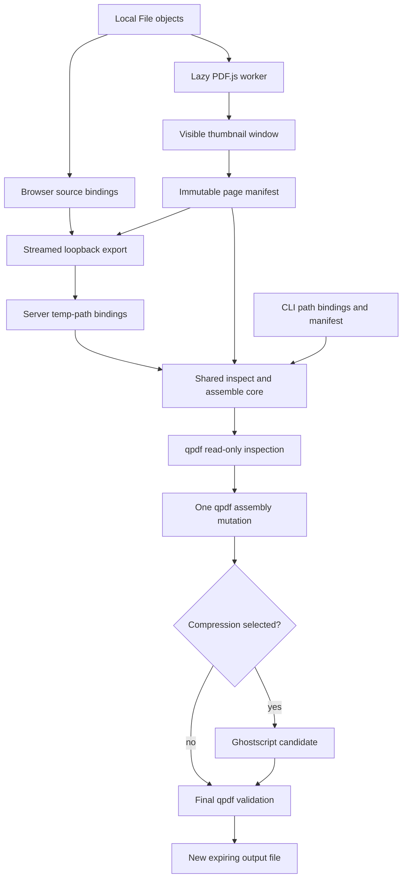
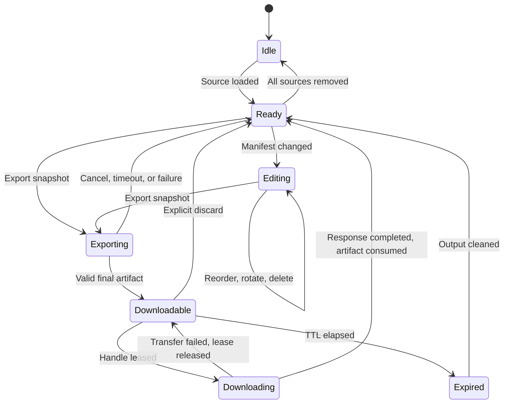

# Lightweight PDF Page Editing - Plan

## Goal Capsule

| Field | Value |
|---|---|
| Objective | Users can reorganize, extract, rotate, and combine PDF pages locally with immediate feedback, then export a new valid PDF without losing the fast compressor workflow or its privacy boundary. |
| Means | Render lazy thumbnails with PDF.js, keep edits as browser state, and create the result in one qpdf assembly pass before optional Ghostscript compression. (KTD1, KTD2, KTD4) |
| Authority | The current request, the session-confirmed page-only scope, and this Product Contract. |
| Execution profile | Start from the implemented compressor branch, pass the static-mock selection gate, then land shared core, CLI, server, UI, and integration proof in dependency order. |
| Stop conditions | Stop before content editing, overlays, forms, OCR, redaction, signing, persistent projects, or cloud processing. Stop after static UI mocks until Lennart selects a direction. |
| Tail ownership | Finish with current documentation, license notices, native integration coverage, bundle and latency evidence, temporary-file cleanup, and no abandoned prototype code. |

---

## Product Contract

### Summary

Add page-level PDF editing before export: preview, reorder, rotate, delete, extract, and merge.
The editor remains local, stages gestures in memory, and writes a new file only when the user exports.
Content-level editing stays outside this plan.

### Problem Frame

The existing product makes local PDF compression simple, but a user must leave the app for basic page surgery.
The original compressor plan deliberately deferred editing, merging, splitting, and page reordering in `docs/plans/2026-07-06-001-feat-local-pdf-compressor-plan.md`.
This follow-up activates only the smallest useful part of that deferred scope.

A generic PDF editor would add a large viewer, another mutation engine, and many document-integrity risks.
Page operations map directly to qpdf, which the application already requires.
The main product challenge is therefore fast and bounded interaction, not broad PDF authoring.

### Key Decisions

- KD1. **Page operations define the editing boundary.** (session-settled: user-directed — chosen over overlays or full content editing: page operations provide the smallest useful feature set with the lowest runtime weight.) Governs R1, R2, R3, R4, R24.

### Requirements

**Page workspace**

- R1. The web app must preview one or more local PDFs as page thumbnails without sending document content to a third-party service.
- R2. The user must be able to reorder, rotate, and delete pages in one combined page sequence.
- R3. The user must be able to add another PDF to the sequence and merge selected pages from all loaded sources.
- R4. “Export selection” must create a separate PDF in the current visible order without removing those pages from the workspace.
- R5. Export must always create a new PDF and must never replace any source file.
- R6. The user may export without compression or apply one existing compression profile after page assembly.

**Speed and resource use**

- R7. Reorder, rotation, deletion, and selection must update browser state without an HTTP request or native process.
- R8. PDF.js must load only when the editor opens, and the normal compressor shell must not eagerly load its renderer or worker.
- R9. Thumbnail rendering must remain bounded to visible pages plus a small overscan window.
- R10. Each export must assemble all requested page operations with one qpdf mutation process.

**Integrity and compatibility**

- R11. The core must reject unknown sources, duplicate source IDs, invalid page numbers, unsupported rotations, and an empty output before starting qpdf.
- R12. Server-side qpdf inspection is authoritative for page counts, advanced document features, and blocked active content.
- R13. The delivered artifact must pass qpdf validation and contain the page count described by the immutable export snapshot.
- R14. Encrypted PDFs and PDFs with digital signatures must be blocked from page export; PDFs containing JavaScript, launch, additional, submit/import, rich-media, or embedded-file actions must also fail closed rather than be sanitized in this MVP.
- R15. The product must warn that inert forms, bookmarks, tags, and custom page labels may not survive page assembly correctly.
- R16. When optional compression yields no smaller valid file, the app must deliver the valid qpdf assembly and report `no_gain`.

**Local security and lifecycle**

- R17. The edit route must stream each uploaded source once into an isolated per-job workspace and must not buffer complete multipart uploads in memory.
- R18. Every local API route must enforce the literal loopback boundary and request context before body consumption; every route except token issuance must also require a short-lived launch token bound to its browser session.
- R19. The server must cap uploads, control data, output growth, retained artifacts, aggregate temporary storage, execution time, and total in-flight native work without an in-memory queue.
- R20. Inputs and intermediate files must be removed after every terminal state; a session-bound output must survive interrupted downloads but be consumed after the first completed download, explicit discard, or a short TTL.

**Web, CLI, and dependency contract**

- R21. Web and CLI must call the same `inspect` and page-assembly behavior from the shared core.
- R22. The CLI must expose machine-readable inspection and assembly commands with one JSON object on stdout.
- R23. PDF.js must be exactly pinned, served locally with a worker from the same package version, and configured with document scripting and dynamic evaluation disabled.
- R24. qpdf must remain the only page-mutation engine, while Ghostscript remains optional for page-only export.
- R25. Before real UI components change, implementation must present several distinct static HTML mocks in the in-app browser and pause for Lennart’s selection.

### Success Criteria

- SC1. The compressor shell’s eager JavaScript grows by no more than 20 KB gzip, because all PDF.js code and assets stay behind the editor boundary.
- SC2. The initial PDF.js display module and worker stay at or below 650 KB gzip, and the complete lazy editor asset graph stays at or below 2 MB gzip, including any codec, font, or CMap assets admitted by the fixture matrix.
- SC3. A cold 20-page, 10 MB reference PDF shows its first thumbnail within 1 second at p95 on the reference development Mac.
- SC4. Reorder, rotate, delete, and selection changes stay below 50 ms at p95 for a 100-page manifest and start no fetch or child process.
- SC5. On fixed 20-page, 100-page, and 500-page corpora, core inspect, assemble, and validate overhead stays within the larger of 300 ms or 20 percent beyond the equivalent direct native pipeline; browser-to-downloadable overhead stays within the larger of 1 second or 35 percent beyond the core pipeline.
- SC6. Source hashes remain unchanged across success, `no_gain`, warning, failure, cancellation, timeout, and client-disconnect scenarios.
- SC7. Cancellation reaches the active native process within 500 ms, terminates its process group within 2 seconds, and removes non-final job data within another 2 seconds.
- SC8. Streaming a 100 MiB multipart export raises local-server peak RSS by less than 32 MiB before native processing begins and never creates a file-sized JavaScript buffer.

### Key Flows

- F1. **Edit and export all pages**
  - **Trigger:** A user opens the editor with one or more PDFs.
  - **Steps:** The browser renders lazy thumbnails, the user changes the page manifest, export freezes a snapshot, the server streams sources, and the core creates one result.
  - **Outcome:** A new validated PDF is available for one-time download.
  - **Covered by:** R1, R2, R3, R5, R6, R7, R10, R13, R17, R20.
- F2. **Export selected pages**
  - **Trigger:** A user selects a subset and chooses “Export selection.”
  - **Steps:** The browser derives a new immutable snapshot from the selected pages without changing the workspace.
  - **Outcome:** A separate PDF contains the selected pages in their current order.
  - **Covered by:** R4, R5, R11, R13.
- F3. **Inspect and assemble from automation**
  - **Trigger:** A script or agent calls the CLI with local source paths.
  - **Steps:** The CLI inspects sources, validates the same manifest contract, assembles the output, and returns one machine-readable result.
  - **Outcome:** Automation receives the same page result and warnings as the web flow.
  - **Covered by:** R11, R12, R13, R21, R22, R24.

### Acceptance Examples

- AE1. **Covers F1.** Given a ten-page PDF, when the user moves page 8 to the front, rotates page 2 clockwise, deletes page 5, and exports, then the new PDF has nine pages in the visible order and the original hash is unchanged.
- AE2. **Covers F1.** Given two PDFs with distinct page markers, when the user interleaves pages from both sources, then the output matches the combined manifest and contains no document-level metadata from an arbitrary secondary source.
- AE3. **Covers F2.** Given selected pages 4, 1, and 7, when the user exports the selection, then the result contains those pages in that order and the workspace remains unchanged.
- AE4. **Covers F1.** Given qpdf is missing, when the user opens a PDF, then local preview still works but export is unavailable with a setup message; missing Ghostscript disables only compression.
- AE5. **Covers F1.** Given an export is cancelled or the browser disconnects, when processing ends, then no partial output is downloadable and all non-final job files are removed.
- AE6. **Covers F1.** Given an encrypted, signed, or active-content PDF, when the user attempts export, then the app blocks page assembly and leaves the source untouched.
- AE7. **Covers F1.** Given a foreign website submits multipart data to the loopback server, when its request lacks the launch token or expected origin context, then the server rejects it before creating a job workspace.
- AE8. **Covers F3.** Given the same sources and manifest are passed through CLI and web, when both exports succeed, then page count, order, rotations, warnings, and source hashes match.
- AE9. **Covers F1.** Given a download is interrupted, when the user retries with the same valid session, then exactly one retry can lease the artifact; the first completed transfer consumes it and later replay fails.

### Scope Boundaries

In scope:

- Page preview, selection, reorder, rotate, delete, merge, and selection export.
- A new output file with optional use of existing compression profiles.
- Web and CLI parity through the shared core.
- Localhost request hardening required by the new multipart route.

#### Deferred to Follow-Up Work

- Adding text, images, stamps, signatures, or other overlays.
- Editing existing page content or form fields.
- OCR, conversion, redaction, annotation, and signing workflows.
- Preserving or repairing bookmarks, tags, form semantics, signatures, or custom page labels after page surgery.
- Persistent projects, edit history, undo stacks, cloud storage, collaboration, and batch orchestration.
- MCP or agent-specific workflow wrappers beyond the CLI primitives.

---

## Planning Contract

### Key Technical Decisions

- KTD1. **Use PDF.js for rendering and qpdf for mutation.** `pdfjs-dist` 6.3.289 contributes about 505 KB gzip for its modern minified display module and worker, while EmbedPDF requires a larger PDFium WASM runtime and a broader viewer stack. This decision implements R1 through R4 and R24. (session-settled: user-directed — chosen over overlays or full content editing: a renderer plus the existing page engine is the smallest architecture for the confirmed page-only scope.)
- KTD2. **Represent document edits with a transport-neutral page manifest.** The browser-safe `PageManifest` contains only invocation-local opaque `sourceId` values, one-based page numbers, and relative rotations. Browser `File` objects, server-generated temp paths, and CLI paths stay in adapter-owned source bindings. Selection, focus, and viewport state never enter the manifest; selection export derives a separate immutable manifest. Export the pure types and transformations from `@pdf-compressor/core/page-manifest`, and prohibit the web app from importing the Node-coupled core root. This gives web, CLI, and core one contract for R2 through R4, R21 through R22, and SC4.
- KTD3. **Keep PDF.js behind a lazy, bounded browser boundary.** Pin version 6.3.289, bundle the matching worker through Vite, allow at most two concurrent render tasks, mount at most 40 thumbnails, cap decoded thumbnail canvases at 32 MiB, cancel off-screen work, and destroy each document task when its source leaves the workspace. Initialize production with scripting and dynamic evaluation disabled, render PDF-derived data only to canvas or escaped text, and enforce a CSP with local scripts/workers only, no inline/eval, frames, objects, forms, or outbound connections. This owns R8, R9, R23, SC1, SC2, and SC3.
- KTD4. **Use one qpdf page-selection mutation per export.** Perform read-only inspection per source, build relative rotations against output page positions, run one qpdf assembly mutation, and run separate final validation. Require qpdf 11.9.0 or newer for the page-file syntax, subject to the security floor in KTD10, while certifying the current local 12.4.1 release. This owns R10, R12, R13, R24, and SC5.
- KTD5. **Treat multi-source assembly as a new document and fail closed on active content.** Use the first source as the primary input for single-document edits and an empty primary for multi-source assembly. Block signed or encrypted inputs plus JavaScript, `/OpenAction`, `/AA`, `/Launch`, submit/import actions, rich media, and embedded files. Treat qpdf warnings that prevent complete inspection as fatal, inspect the final candidate again, and surface only inert document-structure warnings per R14 and R15.
- KTD6. **Let page export own candidate selection and publication.** Apply qpdf structural optimization during the single assembly mutation. If compression is requested, create only a Ghostscript candidate, validate both candidates, and retain the smaller valid result without calling `compressPdf` as an opaque second pipeline. The server publishes inside its app-owned job directory. The CLI stages beside the destination and uses a no-clobber publication primitive so destination validation and publication are one core-owned operation; fail closed on platforms where that guarantee is unavailable. This owns R5, R13, R16, R20, SC6, and SC7.
- KTD7. **Stream multipart data with one small maintained parser.** Add exact-pinned `@fastify/busboy` 3.2.2 to the local server, accept exactly one bounded closed-schema manifest plus generated source parts, and reject duplicate or unknown parts. Never retain a file-sized buffer. This is smaller and safer than a custom multipart parser or base64 JSON and owns R17 and R19.
- KTD8. **Protect the entire loopback API boundary.** Bind only to a literal loopback address. Before body consumption or allocation, require expected Host, current Origin, and non-cross-site fetch metadata on token issuance and every other API route, including existing compression. Issue short-lived, server-tracked random tokens bound to a `SameSite=Strict` browser session and require them on compression, edit, download, and discard. Bind random download handles to that session, atomically lease one transfer, release the lease after a failed transfer, consume it after a completed response, and send `Cache-Control: no-store` without logging tokens, handles, or paths. This owns R18 and R20.
- KTD9. **Keep agent parity primitive and file-based.** Expose `inspect` and `assemble` through the shared core and CLI, but do not add MCP, prompts, or a second workspace model. This owns R21 and R22.
- KTD10. **Treat native parsers as an explicit local trust risk.** Invoke qpdf and Ghostscript with argument arrays and no shell, generated internal names, closed stdin, no extra descriptors, a minimal environment, private working directories, Ghostscript safe/noninteractive flags, bounded output, and process-group termination. Before implementation, review current official advisories and set separate feature and security version floors; fail closed below either floor. Document that native parsing still runs with the user account's filesystem authority unless packaging adds OS isolation.

### High-Level Technical Design

#### Component and data flow



#### Export protocol

```mermaid
sequenceDiagram
  participant Web as Local web app
  participant API as Loopback server
  participant Core as Shared core
  participant Q as qpdf
  participant G as Ghostscript
  Web->>API: Fetch launch token
  Web->>Web: Freeze manifest snapshot
  Web->>API: Stream sources once plus manifest
  API->>Core: Validate sources and snapshot
  loop Each source
    Core->>Q: Inspect source read-only
    Q-->>Core: Page count and findings
  end
  Core->>Q: Assemble once with page selection
  Q-->>Core: Assembly candidate plus warnings
  opt Compression selected
    Core->>G: Compress assembly candidate
    G-->>Core: Compression candidate
  end
  Core->>Q: Validate candidates and blocked actions
  Core->>Core: Select valid deliverable; choose smaller candidate if compressed
  Core-->>API: Result metadata and output path
  API-->>Web: Session-bound download handle
```

#### Editor and job lifecycle



### Initial Safety Limits

The web route starts with these fixed caps. Keep them centralized and cover boundary values in route tests.

| Limit | Initial value |
|---|---:|
| Source PDFs per export | 10 |
| Bytes per source | 100 MiB |
| Total multipart bytes | 100 MiB |
| Manifest bytes | 256 KiB |
| Multipart parts | 11: exactly 1 manifest plus up to 10 sources |
| Multipart header pairs | 50 |
| Source ID | 64 ASCII characters |
| Manifest shape | Closed schema, maximum JSON depth 4 |
| Output pages | 500 |
| Candidate or final output | 150 MiB |
| Native export runtime | 120 seconds |
| Global in-flight native operations | 1 across compression and page export, no queue |
| Retained downloadable jobs | 2 |
| Aggregate app temp storage | 600 MiB |
| Free-disk reserve after allocation | 1 GiB |
| Download artifact TTL | 10 minutes |

Reserve quota before accepting bytes, enforce output growth while native tools write, and reject excess work before a workspace or multipart parser is allocated. Apply source, byte, and page caps in the browser before PDF.js receives a buffer. The CLI keeps filesystem inputs outside the HTTP byte caps but uses the same manifest and page-count validation.

### Dependencies and Prerequisites

- The implemented application exists at `origin/feat/local-pdf-compressor` commit `72af7a1`; current `main` commit `60be4a6` contains planning only.
- Implementation must start from a branch that includes `72af7a1` or after that branch is integrated into `main`.
- Preserve the existing untracked `docs/ideation/2026-09-04-open-source-pdf-editing-ideation.html` artifact when preparing the implementation worktree.
- The supported runtime floor is Node 22.13 because `pdfjs-dist` 6.3.289 requires Node `>=22.13.0 || >=24` for its package tooling.
- qpdf 11.9.0 is the feature floor for the selected page-file syntax; implementation must review current qpdf and Ghostscript advisories and set security floors before native work lands. The higher floor always wins, and local certification covers qpdf 12.4.1.

### System-Wide Impact

| Area | Impact |
|---|---|
| End users | Basic page surgery stays inside the private local workflow and does not slow the simple compression entry path. |
| Automation | CLI gains the same inspect and assemble primitives as the web app without a separate agent layer. |
| Local server | One guarded API boundary owns multipart streaming, launch sessions, download leases, resource quotas, job TTL, and the single global native-operation slot. |
| Core package | A browser-safe page-manifest subpath and Node-only inspection/assembly entrypoint become distinct public contracts. |
| Native tools | qpdf becomes required for page export; Ghostscript remains capability-detected and optional when no compression is selected. |
| Documentation | Existing statements that editing, merge, and split are deferred must be updated without rewriting the historical plan. |

### Risks and Mitigations

| Risk | Mitigation |
|---|---|
| PDF.js increases initial load time. | Lazy-load its display API and matching worker only when the editor opens; enforce SC1 and SC2 after the production build. |
| Crafted PDFs consume excessive browser memory. | Apply KTD3's render-task, mounted-thumbnail, decoded-canvas, source-byte, and page-count limits before allocation. |
| A hostile website targets any existing or new loopback endpoint. | Apply KTD8 as server middleware before token issuance, body consumption, or workspace allocation, including the current compression route. |
| A PDF contains actions that become active after download. | Fail closed on the KTD5 active-content classes before assembly and inspect the final candidate again. |
| qpdf preserves inert document-level structures imperfectly. | Apply KTD5, block signatures, warn for advanced inert features, and test representative forms and bookmarks. |
| Compression damages or enlarges the assembled result. | Apply KTD6 and validate the artifact that will actually be downloaded. |
| Uploads, candidates, or retained outputs exhaust local disk. | Reserve against fixed job and aggregate quotas, enforce output growth, keep one native operation across compression and page export with no queue, and reject work that breaches the free-disk reserve. |
| Output cleanup depends on download behavior. | Lease one download atomically, preserve it after failed transfers, consume it only after a completed response, and enforce discard, TTL, shutdown, and startup cleanup. |
| The browser and CLI drift. | Keep page validation and assembly in the core and run the same manifest fixture through both surfaces. |
| PDF.js or its worker has a security regression. | Pin version 6.3.289, retain its current scripting fix, disable scripting and dynamic evaluation, and review advisories before updates. |
| Native PDF parsers process attacker-controlled bytes with user privileges. | Apply KTD10, fail closed below reviewed security floors, and document unsandboxed local parsing as a residual risk. |
| CLI publication races or crosses filesystems. | Stage on the destination filesystem and make no-clobber publication one core operation; fail closed where the primitive is unavailable. |
| Ghostscript distribution creates license obligations. | Keep it optional for editing and resolve AGPL or commercial distribution separately before packaging binaries. |

### Sources and Research

- Existing architecture: `packages/core/src/compress.ts`, `packages/core/src/engines/qpdf.ts`, `packages/core/src/engines/process.ts`, `apps/local-server/src/routes/compress.ts`, `apps/web/src/App.ts`, `packages/cli/src/commands/compress.ts`, and `docs/architecture/cli-contract.md` on `origin/feat/local-pdf-compressor`.
- Prior option scan: `docs/ideation/2026-09-04-open-source-pdf-editing-ideation.html`.
- [PDF.js getting started](https://mozilla.github.io/pdf.js/getting_started/), [rendering example](https://mozilla.github.io/pdf.js/examples/), and [memory guidance](https://github.com/mozilla/pdf.js/wiki/Frequently-Asked-Questions).
- [PDF.js 6.3.289 release](https://github.com/mozilla/pdf.js/releases/tag/v6.3.289), [2026 scripting advisory](https://github.com/mozilla/pdf.js/security/advisories/GHSA-hq66-cqwq-w95j), and [2024 evaluation advisory](https://github.com/mozilla/pdf.js/security/advisories/GHSA-wgrm-67xf-hhpq).
- [Vite static asset handling](https://vite.dev/guide/assets.html).
- [qpdf page selection, rotation, exit codes, and limitations](https://qpdf.readthedocs.io/en/latest/cli.html) and [qpdf JSON v2](https://qpdf.readthedocs.io/en/latest/json.html).
- [`@fastify/busboy` package](https://www.npmjs.com/package/@fastify/busboy), [Node child processes](https://nodejs.org/api/child_process.html), and [Node temporary directories](https://nodejs.org/api/fs.html#fspromisesmkdtempprefix-options).
- [OWASP File Upload Cheat Sheet](https://cheatsheetseries.owasp.org/cheatsheets/File_Upload_Cheat_Sheet.html) and [OWASP CSRF Prevention Cheat Sheet](https://cheatsheetseries.owasp.org/cheatsheets/Cross-Site_Request_Forgery_Prevention_Cheat_Sheet.html).
- Rejected primary alternative: [EmbedPDF viewer](https://github.com/embedpdf/embed-pdf-viewer) and its [license matrix](https://raw.githubusercontent.com/embedpdf/embed-pdf-viewer/main/LICENSING.md).

---

## Implementation Units

### U1. Static editor direction and selection gate

- **Goal:** Produce several distinct static page-editor directions and obtain Lennart’s selection before touching real UI components.
- **Requirements:** R25.
- **Dependencies:** The implementation branch includes the existing compressor app.
- **Files:** `docs/mocks/lightweight-pdf-editor/option-a.html`, `docs/mocks/lightweight-pdf-editor/option-b.html`, `docs/mocks/lightweight-pdf-editor/option-c.html`.
- **Approach:** Show meaningfully different layouts for multi-file input, thumbnail organization, multi-selection, rotation, deletion, selection export, optional compression, compatibility warnings, and failure states. Open all variants in the in-app browser and stop for user selection.
- **Patterns to follow:** Keep copy minimal and preserve the compressor’s local-first promise.
- **Test scenarios:** Test expectation: none -- these are disposable static decision artifacts with no production behavior.
- **Verification:** Lennart can compare the variants in the in-app browser and selects one direction before U2 through U6 begin.

U1 is the overall execution gate for every production unit below. The dependency fields for U2 through U6 describe the technical graph after that gate is cleared.

### U2. Shared inspection and page-assembly core

- **Goal:** Add one typed core contract that inspects PDFs and assembles an ordered page manifest safely.
- **Requirements:** R5, R10 through R16, R20 through R22, and R24; covers AE1, AE2, AE3, AE5, AE6, and AE8.
- **Dependencies:** The implementation branch includes the existing compressor app.
- **Files:** `packages/core/package.json`, `packages/core/src/page-manifest.ts`, `packages/core/src/pages.ts`, `packages/core/src/engines/qpdf-pages.ts`, `packages/core/src/engines/process.ts`, `packages/core/src/validation.ts`, `packages/core/src/errors.ts`, `packages/core/src/temp-workspace.ts`, `packages/core/src/index.ts`, `packages/core/test/page-manifest.test.ts`, `packages/core/test/pages.test.ts`, `packages/core/test/qpdf-pages.integration.test.ts`, `tests/fixtures/pages-a.pdf`, `tests/fixtures/pages-b.pdf`, `tests/fixtures/signed.pdf`, `tests/fixtures/form-with-bookmark.pdf`, `tests/fixtures/active-actions.pdf`.
- **Approach:**
  1. Publish the pure `PageManifest` subpath and keep browser, server, and CLI source bindings outside it per KTD2.
  2. Define Node-side source inspection, compatibility findings, active-content findings, and the final summary as typed values.
  3. Validate canonical file identity, source IDs, server-authoritative page ranges, rotations, empty output, existing destinations, and the Initial Safety Limits before mutation.
  4. Harden the native process wrapper per KTD10 and reuse it for qpdf inspection, one page-selection mutation, relative rotation, timeout, cancellation, bounded stderr, and exit-code `3` warnings.
  5. Apply KTD5 and KTD6 for primary-input choice, Ghostscript candidate generation, comparison, final active-content validation, destination-local no-clobber publication, and cleanup.
- **Execution note:** Start with failing manifest-validation and real-qpdf integration cases because the shared contract carries the file-integrity promise.
- **Patterns to follow:** Mirror `packages/core/src/compress.ts`, `packages/core/src/temp-workspace.ts`, and `packages/core/src/engines/process.ts` without generalizing the compression-specific engine interface.
- **Test scenarios:**
  - Assemble pages from one fixture in a new order with relative rotations and assert exact page order, rotation, count, and unchanged input hash.
  - Assemble interleaved pages from two fixtures and assert the empty-primary behavior and compatibility warnings.
  - Derive a selection manifest and assert the output is correct while the original manifest and source files remain unchanged.
  - Reject an unknown source, duplicate source ID, page zero, an out-of-range page, invalid rotation, empty output, an existing destination, and a destination that aliases an input through a symlink or hard link.
  - Reject encrypted, signed, JavaScript, open/additional/launch-action, form-submit/import, rich-media, and embedded-file fixtures before page assembly; treat incomplete inspection as fatal and verify the final result again.
  - Return forms, bookmarks, tags, and custom page labels as compatibility warnings without claiming preservation.
  - Treat qpdf exit `3` as a result with warnings, exit `2` as failure, missing qpdf as unavailable, and timeout or abort as cancellation.
  - Assert exactly one qpdf mutation pass. With compression selected, create a Ghostscript candidate and deliver it only when smaller and valid; never publish a compression candidate before comparison and validation.
  - Publish CLI output without clobbering a destination created during export; cover destination inputs on another filesystem, symlink and hard-link aliases, unsupported publication primitives, and adjacent staging-file cleanup.
  - Invoke native tools with no shell, closed stdin, generated option-safe names, a minimal environment, no extra descriptors, safe/noninteractive Ghostscript flags, and whole-process-group termination; reject unsupported feature or security versions.
  - After success, warning, publication failure, native failure, cancellation, and timeout, assert source hashes are unchanged and no intermediate files remain.
- **Verification:** One public core path proves inspect, same-document assembly, multi-document assembly, optional compression, final validation, and cleanup against real qpdf.

### U3. CLI inspection and assembly parity

- **Goal:** Expose the shared page primitives to scripts and agents without adding a separate workflow layer.
- **Requirements:** R5, R11 through R16, R21, R22, R24; covers AE6 and AE8.
- **Dependencies:** U2.
- **Files:** `packages/cli/src/commands/inspect.ts`, `packages/cli/src/commands/assemble.ts`, `packages/cli/src/index.ts`, `packages/cli/src/output.ts`, `packages/cli/test/inspect-command.test.ts`, `packages/cli/test/assemble-command.test.ts`, `packages/cli/test/json-output.test.ts`, `docs/architecture/cli-contract.md`.
- **Approach:** Add `inspect` for one or more local paths and `assemble` for a JSON manifest plus output path. Keep stdout reserved for one JSON result when requested, retain overwrite protection, and map shared core errors to stable exit codes.
- **Execution note:** Lock the JSON success and failure contracts with tests before adding human-readable output.
- **Patterns to follow:** Extend `packages/cli/src/commands/compress.ts` and `packages/cli/src/output.ts`; keep judgment and orchestration outside the CLI.
- **Test scenarios:**
  - Inspect multiple valid PDFs and return stable source IDs, page counts, feature warnings, and qpdf version in one JSON object.
  - Assemble a multi-source manifest and match the core fixture’s page order, rotations, warnings, and output hash properties.
  - Reject malformed JSON, an invalid manifest, a missing source, an existing output without overwrite permission, signed input, and an unsupported qpdf version with stable codes.
  - Cancel an assembly and assert no destination or temp artifact remains.
  - Run the same manifest through the CLI adapter and core and assert normalized summaries match.
- **Verification:** An agent can inspect and assemble local PDFs compositionally with stable machine-readable results and no web-only behavior.

### U4. Streamed and protected loopback export

- **Goal:** Add a bounded multipart export route that calls the shared core without creating a new remote or persistent storage boundary.
- **Requirements:** R5, R11 through R20, R21, R24; covers AE2, AE4, AE5, AE6, and AE7.
- **Dependencies:** U2.
- **Files:** `apps/local-server/package.json`, `package-lock.json`, `apps/local-server/src/routes/edit.ts`, `apps/local-server/src/routes/compress.ts`, `apps/local-server/src/multipart.ts`, `apps/local-server/src/session.ts`, `apps/local-server/src/api-guard.ts`, `apps/local-server/src/jobs.ts`, `apps/local-server/src/server.ts`, `apps/local-server/test/edit-route.test.ts`, `apps/local-server/test/compress-route.test.ts`, `apps/local-server/test/session-security.test.ts`, `apps/local-server/test/job-lifecycle.test.ts`.
- **Approach:**
  1. Apply KTD8 as a server-level guard before request bodies, token minting, jobs, compression, export, download, or discard; keep binding literal-loopback only.
  2. Pin `@fastify/busboy` 3.2.2 and stream generated source filenames plus exactly one bounded, closed-schema manifest into a private per-job directory.
  3. Reserve the Initial Safety Limits before accepting bytes, enforce the single global native-operation slot across compression and page export with no queue, inspect page counts server-side, and stop candidate growth at the output cap.
  4. Create the dedicated app temp root, job directories, sources, candidates, and outputs as current-user-only; never persist client filenames. Sweep only owned, canonical child directories using non-following metadata and ignore symlinks or foreign entries.
  5. After successful publication, remove every uploaded source and unselected candidate immediately; retain only the chosen output for download, discard, or TTL.
  6. Atomically lease a session-bound handle to one downloader. Preserve the result after a source-stream or response failure, consume it after both source and HTTP response complete, and otherwise expire it on discard or TTL.
  7. Harden the existing raw compression route with the same boundary, streaming cap, cancellation, and lifecycle rules.
  8. Expose capability status so missing qpdf disables export and missing Ghostscript disables only compression.
- **Execution note:** Start with failing route-level security, streaming-limit, and lifecycle tests before connecting the web client.
- **Patterns to follow:** Extend `apps/local-server/src/routes/compress.ts` and `apps/local-server/src/server.ts`; do not expose filesystem paths or broaden the loopback host.
- **Test scenarios:**
  - Stream two files plus a manifest and assert each source is written once, the core receives the normalized plan, and the response exposes no local path.
  - Reject token issuance or API use with a foreign Origin, unexpected Host, cross-site fetch metadata, non-loopback binding, wrong session, or a missing/expired token before a temp directory exists; emit no tokens, handles, paths, or client filenames in logs.
  - Reject oversized or deeply nested manifests, duplicate manifests, duplicate/unknown parts or fields, long IDs, excessive headers, limit events during streaming, and each file-count, byte, output, page-count, retained-job, temp-quota, low-disk, timeout, and concurrency boundary with stable errors and cleanup.
  - Reject a compression or page-export request within 100 ms before body allocation while any native operation is in flight; maintain no waiting request queue.
  - Abort on parser failure, client disconnect, core cancellation, or qpdf failure without a downloadable partial artifact. Discard a failed, invalid, oversized, or non-smaller Ghostscript candidate and deliver the validated qpdf assembly as `no_gain` with a warning; keep user cancellation and whole-job timeout fatal.
  - Reject a wrong-session, foreign-origin, expired, replayed, or simultaneous second download. Release the lease after client disconnect, source read error, or response failure; permit one retry; consume after a completed response.
  - Remove uploaded sources and unselected candidates immediately after successful final publication; delete the retained output after a completed download, explicit discard, TTL expiry, shutdown, and startup orphan sweep.
  - Create user-only job permissions and prove hostile symlinks, foreign directories, and non-owned temp-root entries are ignored by cleanup.
  - Exercise the existing compression endpoint against the same Host, Origin, token, byte, disconnect, cancellation, and cleanup contract.
  - Report qpdf and Ghostscript capabilities independently.
- **Verification:** The loopback route streams bounded input, rejects cross-site mutation, preserves source privacy, and leaves no orphaned job data across every terminal state.

### U5. Lazy thumbnail editor and export experience

- **Goal:** Implement the selected page-editor direction with immediate browser-state operations and lazy local rendering.
- **Requirements:** R1 through R10, R14 through R18, R20, R23, R25; covers AE1 through AE7.
- **Dependencies:** U1 selection, U2, and U4.
- **Files:** `apps/web/package.json`, `package-lock.json`, `apps/web/src/App.ts`, `apps/web/src/api/client.ts`, `apps/web/src/editor/model.ts`, `apps/web/src/editor/pdf-preview.ts`, `apps/web/src/components/PageEditor.ts`, `apps/web/src/components/PageThumbnail.ts`, `apps/web/src/components/EditorActions.ts`, `apps/web/src/components/ExportOptions.ts`, `apps/web/src/styles.css`, `apps/web/test/editor-model.test.ts`, `apps/web/test/editor-flow.test.ts`.
- **Approach:**
  1. Pin `pdfjs-dist` 6.3.289 and lazy-load only its display API and matching Vite-emitted worker asset per KTD3.
  2. Disable PDF scripting and dynamic evaluation, feed each loading task its own byte buffer, render derived data only to canvas or escaped text, and load optional assets only when the fixture matrix requires them.
  3. Enforce the source, byte, and page caps before PDF.js allocation; allow at most two render tasks, 40 mounted thumbnails, and 32 MiB of decoded thumbnail canvases while cancelling and releasing off-screen work.
  4. Keep reorder, deletion, and rotation in the pure manifest model while selection, focus, source bindings, and viewport state remain browser-only; provide pointer and keyboard-accessible controls without a drag-and-drop dependency.
  5. Freeze and lock an export snapshot, stream each source once, show compatibility findings, and restore editing after success, failure, or cancellation.
- **Execution note:** Implement the pure manifest model before the selected visual layer so page behavior stays testable without PDF rendering.
- **Patterns to follow:** Retain the direct DOM factory style used by `apps/web/src/App.ts` and existing components; do not add React, a state library, or the generic PDF.js viewer.
- **Test scenarios:**
  - Add one PDF, reorder, rotate, delete, and reset pages while asserting deterministic immutable manifest transitions; assert selection and focus change only browser UI state.
  - Add two files with the same display name and retain distinct generated source identities and page references.
  - Export a selection without changing the workspace manifest.
  - Freeze the visible state during export and prevent late gestures from changing the submitted snapshot.
  - Show preview with missing qpdf while disabling export; hide compression choices when Ghostscript is missing.
  - Display signed, encrypted, forms, bookmarks, tags, and page-label outcomes according to R14 and R15.
  - Reject over-limit inputs before PDF.js receives bytes; cancel off-screen thumbnail tasks, destroy removed document tasks, and enforce the two-task, 40-thumbnail, and 32 MiB canvas bounds.
  - Load malicious scripting and dynamic-evaluation fixtures in a real browser and assert no sentinel executes, no network request occurs, and the loopback session token remains inaccessible under the production CSP.
  - Reject server security, limit, validation, cancellation, and timeout results without losing the user’s editable manifest.
- **Verification:** The chosen UI completes the page flows with no per-gesture network or native work, preserves the simple compressor path, and satisfies SC1 through SC4.

### U6. Native integration, performance evidence, and documentation

- **Goal:** Prove the complete browser, server, core, CLI, and native-tool path and document the expanded product honestly.
- **Requirements:** R1 through R25; covers AE1 through AE9 and SC1 through SC8.
- **Dependencies:** U2, U3, U4, and U5.
- **Files:** `.github/workflows/ci.yml`, `package.json`, `vitest.config.ts`, `tests/helpers/pdf-assertions.ts`, `tests/integration/page-editing.test.ts`, `tests/performance/corpus-20.pdf`, `tests/performance/corpus-100.pdf`, `tests/performance/corpus-500.pdf`, `scripts/check-editor-bundle.mjs`, `scripts/check-native-versions.mjs`, `scripts/benchmark-page-editor.mjs`, `docs/benchmarks/page-editor-baseline.json`, `README.md`, `CONTRIBUTING.md`, `SECURITY.md`, `docs/privacy.md`, `docs/security.md`, `docs/architecture/compression-engine.md`, `docs/architecture/dependency-licenses.md`, `docs/architecture/page-editing.md`.
- **Approach:** Add a real-qpdf CI lane, keep Ghostscript capability-dependent, verify native security floors and the complete production asset graph, exercise the built app in a real browser, and record a reproducible performance baseline. The benchmark records commit, hardware, OS, browser, Node/native versions, production asset hashes, corpus hashes, five warmups, and twenty measured runs for each corpus. Update product, privacy, security, CLI, architecture, and license documentation while keeping the historical compressor plan unchanged.
- **Execution note:** Run the native and browser checks against the built artifact, because mocks and jsdom cannot prove PDF.js worker loading, canvas cleanup, qpdf output, or localhost request protection.
- **Patterns to follow:** Extend the current root scripts and CI workflow without creating a second test framework unless real-browser verification proves it necessary.
- **Test scenarios:**
  - Run the full edit-and-export flow with real PDF.js assets, multipart streaming, qpdf, download, and cleanup.
  - Run the same manifest through web and CLI and compare page order, rotations, page count, warnings, and unchanged source hashes.
  - Render representative output pages to catch visible regressions that qpdf structural checks cannot detect.
  - Measure cold first-thumbnail time, 100-page gesture latency, render-task and canvas bounds, streaming memory overhead, cancellation timing, complete lazy-asset gzip size, and core-versus-native plus browser-versus-core export timing on the fixed 20-page, 100-page, and 500-page corpora against SC1 through SC5, SC7, and SC8.
  - Verify the production server rejects a simulated cross-site multipart request before disk allocation.
  - Verify production CSP blocks embedded scripting, evaluation, framing, objects, form submission, and outbound requests while permitting the local version-matched worker.
  - Verify a successful artifact disappears after first download and an abandoned artifact disappears after TTL and restart cleanup.
- **Verification:** CI proves the typed and native contracts, browser verification proves the built user flow, and the recorded measurements meet every success criterion.

---

## Verification Contract

| Gate | Command or method | Required outcome |
|---|---|---|
| Install | `npm ci` | Exact PDF.js and multipart-parser versions install without lockfile drift. |
| Types | `npm run typecheck` | All workspaces and shared manifest types compile on Node 22.13 or newer. |
| Unit and route tests | `npm test` | Core validation, CLI contracts, browser state, route security, limits, and cleanup pass. |
| Native integration | `npm run test:integration` | Real qpdf proves inspect, assembly, rotation, warnings, final validation, parity, and immutable sources. |
| Production build | `npm run build` | Vite emits a local version-matched PDF.js worker and no remote document dependency. |
| Bundle budget | `npm run check:editor-bundle` | SC1 and SC2 pass against production gzip sizes. |
| Browser behavior | Run the built local app through `ce-test-browser` | First-thumbnail, editor actions, multi-file merge, selection export, cancellation, warning, and cleanup flows pass. |
| Performance | `npm run benchmark:page-editor` | Fixed corpus hashes, environment metadata, five warmups, twenty measurements, and SC3 through SC5 plus SC7 and SC8 pass on the reference development Mac. |
| Security | Route integration, native-version gate, and real-browser cross-site and malicious-PDF probes | Session/token/handle binding, Host, Origin, fetch metadata, CSP, active-content blocking, native floors, quotas, and pre-allocation rejection behave as specified. |
| Full regression | `npm run typecheck && npm test && npm run test:integration && npm run build && npm run check:editor-bundle` | Compression, CLI, local server, page editing, and docs finish green together. |

---

## Definition of Done

- U1 is complete only after Lennart selects a static editor direction in the in-app browser.
- U2 is complete when real qpdf proves the browser-safe manifest boundary, Node-side inspect and assembly contract, one qpdf mutation, active-content rejection, immutable sources, final validation, optional-compression fallback, no-clobber publication, and cleanup.
- U3 is complete when automation can inspect and assemble with stable one-object JSON and output protection.
- U4 is complete when every API route enforces the loopback session boundary, export and existing compression streams enforce all safety limits, download leasing supports failed-transfer retry, and every expired or failed job artifact is removed safely.
- U5 is complete when the selected UI passes all page flows without eager PDF.js loading or per-gesture native work and malicious PDFs cannot execute or escape the production CSP.
- U6 is complete when CI, built-browser verification, reproducible benchmark evidence, documentation, license notices, and SC1 through SC8 are complete.
- The implementation branch contains the compressor base commit `72af7a1` and preserves unrelated user artifacts.
- No content-editing dependency, generic viewer, frontend framework, state library, MCP layer, cloud service, or persistent project store is added.
- All experimental branches, unused assets, dead adapters, disposable raw benchmark output, and superseded mock code are removed before handoff; the reviewed baseline remains in `docs/benchmarks/page-editor-baseline.json`.
